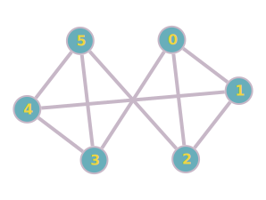
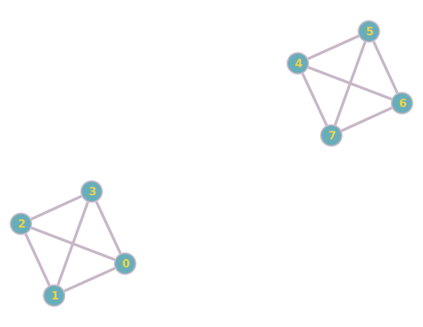

# Graphen in Java analysieren

Dies ist eine Implementierung des bekannten "Graphenprogrammes" in Java mit Java Streams.

## Start des Programmes

Voraussetzung ist eine Java SDK in der Version 17 oder höher. Prüfe dies, indem du `java --version` eingibst.
Klone das Repository mit
```
git clone https://github.com/schletz/GraphenprogrammJava
```

Führe danach im Ordner des Repositories die Datei *start.cmd* (Windows) bzw. *start.sh* (macOS, Windows git bash) aus.
Die Algorithmen sind in der Datei [Graph.java](Graph.java) in den Kommentaren erklärt.

Du kannst das Verzeichnis auch in IntelliJ als Projekt öffnen.
Öffne danach die Program Klasse und konfiguriere mit "Setup SDK" einmalig deine SDK (mindestens Version 17).
Danach kannst du das Programm auch in IntelliJ starten.

Es werden 7 Textdateien mit Graphen mitgeliefert (gezeichnet mit <small>https://graphonline.ru/en</small>):

|                                                     |                                                             |
| --------------------------------------------------- | ----------------------------------------------------------- |
| **3n_isolated**                                     | **6n_01**                                                   |
| [](3n_isolated_0642.svg)   | [](6n_01_0642.svg)                       |
| **6n_full**                                         | **8n_full_isolated**                                        |
| [](6n_full_0642.svg)           | [](8n_full_isolated_0642.svg) |
| **24n_01**                                          | **24n_02**                                                  |
| [](24n_01_1949.svg)             | [](24n_02_1949.svg)                     |
| **24n_weighted**                                    |                                                             |
| [](24n_weighted_0923.svg) |                                                             |


## Analyseergebnisse

### 24n_01.csv
```
ANALYSE DES GRAPHEN:
Distanzmatrix des Graphen (leer = unendlich):
     0  1  2  3  4  5  6  7  8  9 10 11 12 13 14 15 16 17 18 19 20 21 22 23
  0  0  1  2  2
  1  1  0  1  1
  2  2  1  0  1
  3  2  1  1  0
  4              0  1  1  1  1  2  2  2  3  3  4  4  3  5  5  4  4
  5              1  0  1  2  2  3  3  2  3  4  5  5  4  6  6  5  5
  6              1  1  0  2  2  3  3  1  2  4  5  5  4  6  6  5  5
  7              1  2  2  0  1  1  1  3  4  2  3  3  2  4  4  3  3
  8              1  2  2  1  0  2  2  3  4  3  4  4  3  5  5  4  4
  9              2  3  3  1  2  0  1  4  5  2  3  3  2  4  4  3  3
 10              2  3  3  1  2  1  0  4  5  1  2  2  1  3  3  2  2
 11              2  2  1  3  3  4  4  0  1  5  6  6  5  7  7  6  6
 12              3  3  2  4  4  5  5  1  0  6  7  7  6  8  8  7  7
 13              3  4  4  2  3  2  1  5  6  0  1  2  2  2  2  3  3
 14              4  5  5  3  4  3  2  6  7  1  0  1  2  1  1  3  3
 15              4  5  5  3  4  3  2  6  7  2  1  0  1  2  2  2  2
 16              3  4  4  2  3  2  1  5  6  2  2  1  0  3  3  1  1
 17              5  6  6  4  5  4  3  7  8  2  1  2  3  0  1  4  4
 18              5  6  6  4  5  4  3  7  8  2  1  2  3  1  0  4  4
 19              4  5  5  3  4  3  2  6  7  3  3  2  1  4  4  0  1
 20              4  5  5  3  4  3  2  6  7  3  3  2  1  4  4  1  0
 21                                                                 0  1  1
 22                                                                 1  0  1
 23                                                                 1  1  0
Anzahl der Knoten: 24
Anzahl der Kanten: 29
Knotengrade:
[0]: 1, [1]: 3, [2]: 2, [3]: 2, [4]: 4, [5]: 2, [6]: 3, [7]: 4, [8]: 2, [9]: 2, [10]: 4, [11]: 2,
[12]: 1, [13]: 2, [14]: 4, [15]: 2, [16]: 4, [17]: 2, [18]: 2, [19]: 2, [20]: 2, [21]: 2, [22]: 2, [23]: 2
Der Graph hat 3 Komponenten:
[0,1,2,3]
[4,5,6,7,8,9,10,11,12,13,14,15,16,17,18,19,20]
[21,22,23]
Exzentrizitäten der Knoten:
[0]: inf, [1]: inf, [2]: inf, [3]: inf, [4]: inf, [5]: inf, [6]: inf, [7]: inf, [8]: inf, [9]: inf,
[10]: inf, [11]: inf, [12]: inf, [13]: inf, [14]: inf, [15]: inf, [16]: inf, [17]: inf, [18]: inf,
[19]: inf, [20]: inf, [21]: inf, [22]: inf, [23]: inf
Durchmesser des Graphen: inf
Radius des Graphen:      inf
Zentrum des Graphen:             []
Artikulationspunkte des Graphen: [1,4,6,7,10,11,14,16]
Brücken des Graphen:             [[0,1],[6,11],[11,12]]
```

### 24n_02.csv

```
ANALYSE DES GRAPHEN:
Distanzmatrix des Graphen (leer = unendlich):
     0  1  2  3  4  5  6  7  8  9 10 11 12 13 14 15 16 17 18 19 20 21 22 23
  0  0  1  2  2  3  4  4  4  4  5  5  5  6  6  7  7  6  8  8  7  7  8  9  9
  1  1  0  1  1  2  3  3  3  3  4  4  4  5  5  6  6  5  7  7  6  6  7  8  8
  2  2  1  0  1  1  2  2  2  2  3  3  3  4  4  5  5  4  6  6  5  5  6  7  7
  3  2  1  1  0  1  2  2  2  2  3  3  3  4  4  5  5  4  6  6  5  5  6  7  7
  4  3  2  1  1  0  1  1  1  1  2  2  2  3  3  4  4  3  5  5  4  4  5  6  6
  5  4  3  2  2  1  0  1  2  2  3  3  2  3  4  5  5  4  6  6  5  5  6  7  7
  6  4  3  2  2  1  1  0  2  2  3  3  1  2  4  5  5  4  6  6  5  5  6  7  7
  7  4  3  2  2  1  2  2  0  1  1  1  3  4  2  3  3  2  4  4  3  3  4  5  5
  8  4  3  2  2  1  2  2  1  0  2  2  3  4  3  4  4  3  5  5  4  4  5  6  6
  9  5  4  3  3  2  3  3  1  2  0  1  4  5  2  3  3  2  4  4  3  3  4  5  5
 10  5  4  3  3  2  3  3  1  2  1  0  4  5  1  2  2  1  3  3  2  2  3  4  4
 11  5  4  3  3  2  2  1  3  3  4  4  0  1  5  6  6  5  7  7  6  6  7  8  8
 12  6  5  4  4  3  3  2  4  4  5  5  1  0  6  7  7  6  8  8  7  7  8  9  9
 13  6  5  4  4  3  4  4  2  3  2  1  5  6  0  1  2  2  2  2  3  3  4  5  5
 14  7  6  5  5  4  5  5  3  4  3  2  6  7  1  0  1  2  1  1  3  3  4  5  5
 15  7  6  5  5  4  5  5  3  4  3  2  6  7  2  1  0  1  2  2  2  2  3  4  4
 16  6  5  4  4  3  4  4  2  3  2  1  5  6  2  2  1  0  3  3  1  1  2  3  3
 17  8  7  6  6  5  6  6  4  5  4  3  7  8  2  1  2  3  0  1  4  4  5  6  6
 18  8  7  6  6  5  6  6  4  5  4  3  7  8  2  1  2  3  1  0  4  4  5  6  6
 19  7  6  5  5  4  5  5  3  4  3  2  6  7  3  3  2  1  4  4  0  1  2  3  3
 20  7  6  5  5  4  5  5  3  4  3  2  6  7  3  3  2  1  4  4  1  0  1  2  2
 21  8  7  6  6  5  6  6  4  5  4  3  7  8  4  4  3  2  5  5  2  1  0  1  1
 22  9  8  7  7  6  7  7  5  6  5  4  8  9  5  5  4  3  6  6  3  2  1  0  1
 23  9  8  7  7  6  7  7  5  6  5  4  8  9  5  5  4  3  6  6  3  2  1  1  0
Anzahl der Knoten: 24
Anzahl der Kanten: 32
Knotengrade:
[0]: 1, [1]: 3, [2]: 3, [3]: 3, [4]: 6, [5]: 2, [6]: 3, [7]: 4, [8]: 2, [9]: 2, [10]: 4, [11]: 2,
[12]: 1, [13]: 2, [14]: 4, [15]: 2, [16]: 4, [17]: 2, [18]: 2, [19]: 2, [20]: 3, [21]: 3, [22]: 2, [23]: 2
Der Graph hat 1 Komponenten:
[0,1,2,3,4,5,6,7,8,9,10,11,12,13,14,15,16,17,18,19,20,21,22,23]
Exzentrizitäten der Knoten:
[0]: 9, [1]: 8, [2]: 7, [3]: 7, [4]: 6, [5]: 7, [6]: 7, [7]: 5, [8]: 6, [9]: 5, [10]: 5, [11]: 8,
[12]: 9, [13]: 6, [14]: 7, [15]: 7, [16]: 6, [17]: 8, [18]: 8, [19]: 7, [20]: 7, [21]: 8, [22]: 9, [23]: 9
Durchmesser des Graphen: 9
Radius des Graphen:      5
Zentrum des Graphen:             [7,9,10]
Artikulationspunkte des Graphen: [1,4,6,7,10,11,14,16,20,21]
Brücken des Graphen:             [[0,1],[6,11],[11,12],[20,21]]
```

### 3n_isolated.csv

```
ANALYSE DES GRAPHEN:
Distanzmatrix des Graphen (leer = unendlich):
     0  1  2
  0  0      
  1     0   
  2        0
Anzahl der Knoten: 3
Anzahl der Kanten: 0
Knotengrade:
[0]: 0, [1]: 0, [2]: 0
Der Graph hat 3 Komponenten:
[0]
[1]
[2]
Exzentrizitäten der Knoten:
[0]: inf, [1]: inf, [2]: inf
Durchmesser des Graphen: inf
Radius des Graphen:      inf
Zentrum des Graphen:             []
Artikulationspunkte des Graphen: []
Brücken des Graphen:             []
```

### 6n_01.csv

```
ANALYSE DES GRAPHEN:
Distanzmatrix des Graphen (leer = unendlich):
     0  1  2  3  4  5
  0  0  1  1  1  2  2
  1  1  0  1  2  1  2
  2  1  1  0  2  2  1
  3  1  2  2  0  1  1
  4  2  1  2  1  0  1
  5  2  2  1  1  1  0
Anzahl der Knoten: 6
Anzahl der Kanten: 9
Knotengrade:
[0]: 3, [1]: 3, [2]: 3, [3]: 3, [4]: 3, [5]: 3
Der Graph hat 1 Komponenten:
[0,1,2,3,4,5]
Exzentrizitäten der Knoten:
[0]: 2, [1]: 2, [2]: 2, [3]: 2, [4]: 2, [5]: 2
Durchmesser des Graphen: 2
Radius des Graphen:      2
Zentrum des Graphen:             [0,1,2,3,4,5]
Artikulationspunkte des Graphen: []
Brücken des Graphen:             []
```

### 6n_full.csv

```
ANALYSE DES GRAPHEN:
Distanzmatrix des Graphen (leer = unendlich):
     0  1  2  3  4  5
  0  0  1  1  1  1  1
  1  1  0  1  1  1  1
  2  1  1  0  1  1  1
  3  1  1  1  0  1  1
  4  1  1  1  1  0  1
  5  1  1  1  1  1  0
Anzahl der Knoten: 6
Anzahl der Kanten: 15
Knotengrade:
[0]: 5, [1]: 5, [2]: 5, [3]: 5, [4]: 5, [5]: 5
Der Graph hat 1 Komponenten:
[0,1,2,3,4,5]
Exzentrizitäten der Knoten:
[0]: 1, [1]: 1, [2]: 1, [3]: 1, [4]: 1, [5]: 1
Durchmesser des Graphen: 1
Radius des Graphen:      1
Zentrum des Graphen:             [0,1,2,3,4,5]
Artikulationspunkte des Graphen: []
Brücken des Graphen:             []
```

### 8n_full_isolated.csv

```
ANALYSE DES GRAPHEN:
Distanzmatrix des Graphen (leer = unendlich):
     0  1  2  3  4  5  6  7
  0  0  1  1  1
  1  1  0  1  1
  2  1  1  0  1
  3  1  1  1  0
  4              0  1  1  1
  5              1  0  1  1
  6              1  1  0  1
  7              1  1  1  0
Anzahl der Knoten: 8
Anzahl der Kanten: 12
Knotengrade:
[0]: 3, [1]: 3, [2]: 3, [3]: 3, [4]: 3, [5]: 3, [6]: 3, [7]: 3
Der Graph hat 2 Komponenten:
[0,1,2,3]
[4,5,6,7]
Exzentrizitäten der Knoten:
[0]: inf, [1]: inf, [2]: inf, [3]: inf, [4]: inf, [5]: inf, [6]: inf, [7]: inf
Durchmesser des Graphen: inf
Radius des Graphen:      inf
Zentrum des Graphen:             []
Artikulationspunkte des Graphen: []
Brücken des Graphen:             []
```

### 24n_weighted.csv

```
ANALYSE DES GRAPHEN:
Distanzmatrix des Graphen (leer = unendlich):
     0  1  2  3  4  5  6  7  8  9 10 11 12 13 14 15 16 17 18 19 20 21 22 23
  0  0  3  1  4  3  2  2  3  3  2  3  3  3  1  3  2  2  2  2  2  3  2  3  4
  1  3  0  2  2  3  2  3  1  4  2  3  2  3  3  1  4  2  3  2  1  1  2  2  3
  2  1  2  0  3  2  2  1  2  2  1  2  3  2  2  2  3  1  1  1  1  2  2  2  3
  3  4  2  3  0  1  2  3  1  3  2  3  2  1  3  1  4  2  2  2  2  1  2  2  3
  4  3  3  2  1  0  1  3  2  3  1  4  3  2  3  2  3  3  2  2  2  2  3  3  4
  5  2  2  2  2  1  0  3  1  4  2  3  3  3  3  1  4  2  3  1  2  2  2  2  3
  6  2  3  1  3  3  3  0  2  3  2  3  4  3  3  3  4  2  2  2  2  3  2  3  4
  7  3  1  2  1  2  1  2  0  4  2  3  3  2  3  2  4  1  3  2  1  2  2  3  4
  8  3  4  2  3  3  4  3  4  0  3  3  3  2  2  3  4  3  1  3  3  4  3  3  4
  9  2  2  1  2  1  2  2  2  3  0  3  3  3  3  2  2  2  2  2  1  2  3  3  4
 10  3  3  2  3  4  3  3  3  3  3  0  3  3  3  2  4  2  3  3  3  2  2  3  4
 11  3  2  3  2  3  3  4  3  3  3  3  0  3  2  3  3  2  2  2  2  1  2  2  3
 12  3  3  2  1  2  3  3  2  2  3  3  3  0  2  2  4  1  1  3  3  2  2  3  4
 13  1  3  2  3  3  3  3  3  2  3  3  2  2  0  2  2  2  1  3  3  2  1  3  4
 14  3  1  2  1  2  1  3  2  3  2  2  3  2  2  0  3  2  2  1  1  2  1  2  3
 15  2  4  3  4  3  4  4  4  4  2  4  3  4  2  3  0  3  3  4  3  3  2  3  4
 16  2  2  1  2  3  2  2  1  3  2  2  2  1  2  2  3  0  2  2  2  1  1  2  3
 17  2  3  1  2  2  3  2  3  1  2  3  2  1  1  2  3  2  0  2  2  3  2  3  4
 18  2  2  1  2  2  1  2  2  3  2  3  2  3  3  1  4  2  2  0  2  1  2  1  2
 19  2  1  1  2  2  2  2  1  3  1  3  2  3  3  1  3  2  2  2  0  1  2  2  3
 20  3  1  2  1  2  2  3  2  4  2  2  1  2  2  2  3  1  3  1  1  0  1  1  2
 21  2  2  2  2  3  2  2  2  3  3  2  2  2  1  1  2  1  2  2  2  1  0  2  3
 22  3  2  2  2  3  2  3  3  3  3  3  2  3  3  2  3  2  3  1  2  1  2  0  1
 23  4  3  3  3  4  3  4  4  4  4  4  3  4  4  3  4  3  4  2  3  2  3  1  0
Anzahl der Knoten: 24
Anzahl der Kanten: 204
Knotengrade:
[0]: 18, [1]: 12, [2]: 17, [3]: 20, [4]: 15, [5]: 15, [6]: 20, [7]: 19, [8]: 18,
[9]: 16, [10]: 17,[11]: 16,[12]: 16, [13]: 17, [14]: 19, [15]: 18, [16]: 20,
[17]: 20, [18]: 17, [19]: 16, [20]: 20, [21]: 20, [22]: 21, [23]: 1
Der Graph hat 1 Komponenten:
[0,1,2,3,4,5,6,7,8,9,10,11,12,13,14,15,16,17,18,19,20,21,22,23]
Exzentrizitäten der Knoten:
[0]: 4, [1]: 4, [2]: 3, [3]: 4, [4]: 4, [5]: 4, [6]: 4, [7]: 4, [8]: 4,
[9]: 4,[10]: 4, [11]: 4,[12]: 4, [13]: 4, [14]: 3, [15]: 4, [16]: 3,
[17]: 4, [18]: 4, [19]: 3, [20]: 4, [21]: 3, [22]: 3, [23]: 4
Durchmesser des Graphen: 4
Radius des Graphen:      3
Zentrum des Graphen:             [2,14,16,19,21,22]
Artikulationspunkte des Graphen: [22]
Brücken des Graphen:             [[22,23]]
```
